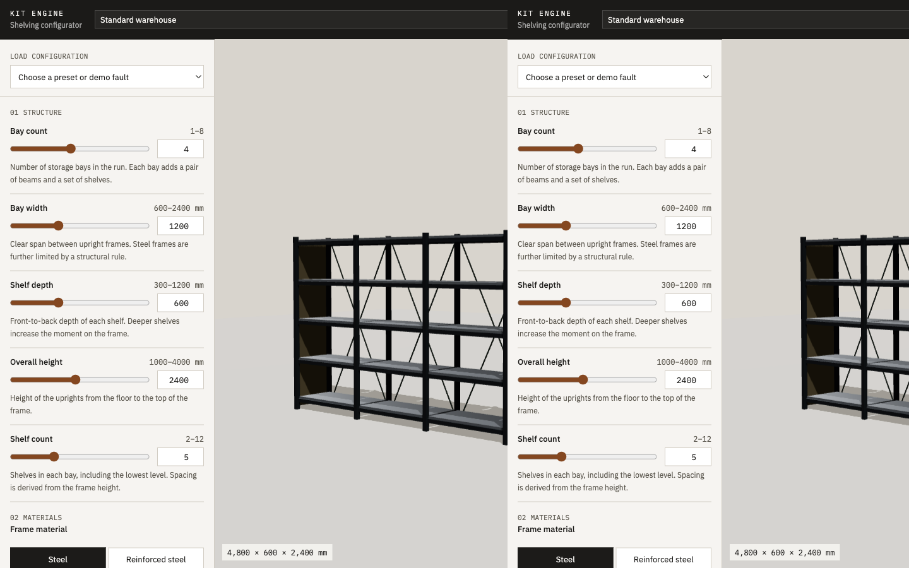
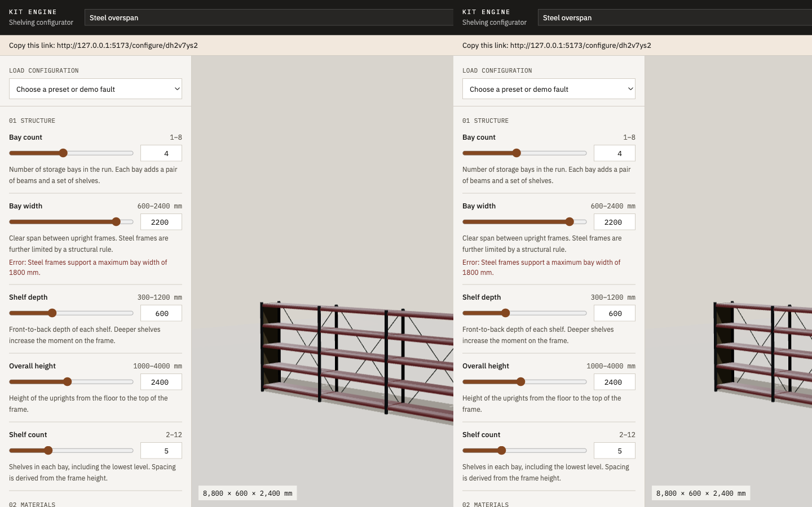
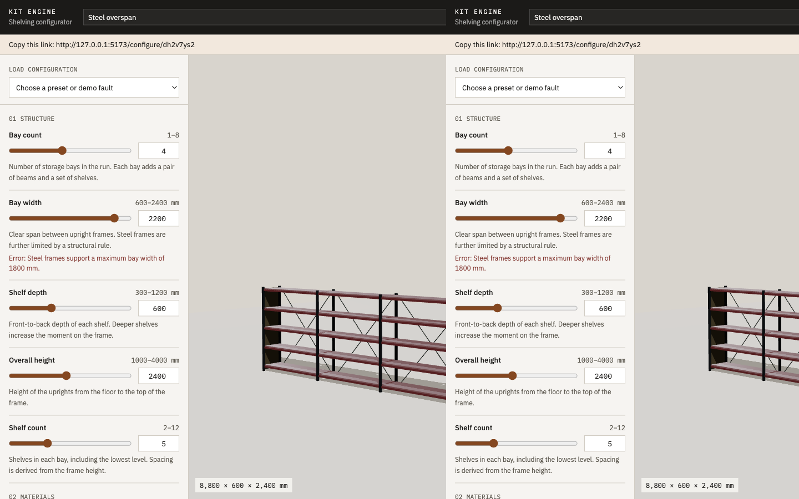

# Kit Engine

Kit Engine is a real-time configurator for a modular warehouse shelving system. A sales engineer changes bay count, span, height, materials, load, bracing, and accessories. The same evaluation produces the 3D model, the structural checks, the price, and the specification.

The product idea is: define the product once, as parameters and rules, and generate variants from that definition instead of modelling every combination by hand.

## Problem

Shelving is not a free-form 3D scene. Bay width, frame material, depth, height, and load rating constrain each other. A form that only checks min and max cannot say why a 2200 mm steel bay is unsafe, and a price buried in the UI will drift away from those rules.

## Solution

```
parameters → rule graph → derived values → validation → geometry / price / specification
```

The rule engine is plain TypeScript. React and Three.js read its result. They do not decide whether a configuration is valid, and they do not calculate the price.

## Architecture

| Layer | Responsibility |
| --- | --- |
| `src/engine` | Parameters, DSL, evaluation, derived values, pricing, layout numbers, specification text |
| `src/store` | Configuration, undo/redo, approved custom rules |
| `src/scene` | Parametric meshes from `buildLayout` |
| `src/components` | Controls, validation, price, rule review |
| `src/pdf` | Quote document rendered from a specification model |
| `server` | Share and rule persistence, Claude compilation |

Details are in [docs/architecture.md](docs/architecture.md).

## Rule engine

Rules are a small DSL, not JavaScript. The built-in catalogue lives in `src/engine/builtin.dsl.ts` and is parsed at startup. A rule fires only when every `WHEN` predicate matches and the `THEN` constraint does not. Failures carry the current value, the limit, an explanation, a suggestion, and optional fixes.

```
WHEN frameMaterial == "steel"
THEN bayWidth <= 1800
```

Steel at 1800 mm is valid. Steel at 1801 mm is not. Reinforced steel at 2400 mm is valid. Load above 600 kg, depth from 900 mm, and height above 3000 mm require heavy-duty bracing. A run of 6 or more bays warns if the safety back is off. Grammar and limits: [docs/rule-dsl.md](docs/rule-dsl.md).

## 3D system

The shelving run is built from boxes: uprights, beams, shelves, X-braces, end guards, label rails, and a safety back. `buildLayout` turns millimetres into metres. Bay count changes the number of frames. Bay width changes the span. Materials change colour, roughness, and section size. The scene does not load a CAD file and scale it.

## AI rule authoring

The AI Rule Author sends a sentence to Claude and gets a proposed rule back. The response is schema-checked, printed as DSL, and parsed with the same parser as the built-in rules. The engineer sees a diff and chooses Reject or Approve. Approval is what adds the rule to the engine. See [docs/ai-rule-authoring.md](docs/ai-rule-authoring.md).

## Performance

Evaluation is local. A 1000-run benchmark of the default configuration on this machine averaged about 0.003 ms, with a max under 1 ms, across 9 rules and 13 parameters. The automated test fails if the average or max reaches 100 ms. In development, the Rules tab has **Run evaluation benchmark**. See [docs/performance.md](docs/performance.md).

## Technical decisions

Why a custom engine, why the evaluation stays on the client, why the DSL is small, and why AI cannot write rules straight into the catalogue: [docs/design-decisions.md](docs/design-decisions.md).

The parameter catalogue is in [docs/configuration-model.md](docs/configuration-model.md).

## Run it

```bash
npm install
npm run dev
```

Open the URL Vite prints. The default view is a four-bay steel run.

Optional `.env` (see `.env.example`):

- `ANTHROPIC_API_KEY` — required for AI rule proposals. Without it, the author panel says the API is not configured.
- `ANTHROPIC_MODEL` — defaults to `claude-sonnet-4-5`.
- `DATABASE_URL` — PostgreSQL. When unset, shares and approved rules are stored in `data/store.json`.

```bash
npm test
npm run lint
npm run build
```

## Demo

1. Drag **Bay width**. The run grows with the slider.
2. Load **Steel overspan**. The status becomes CONFIGURATION INVALID and names the 1800 mm steel limit. Apply a fix, or switch the frame to reinforced steel.
3. Load **High load, standard brace**, **Tall frame, standard brace**, or **Deep shelf, standard brace**.
4. Load **Retail shelving** for a valid configuration with a timber-span warning.
5. Undo with the button or Command/Ctrl+Z. A slider drag is one history entry, recorded when the pointer is released.
6. **Share** saves a snapshot and copies `/configure/:id`. Opening that URL re-evaluates the rules. Saved validation is never trusted.
7. **Download specification** builds a PDF from the current evaluation.
8. In **Rules**, describe a constraint, review the proposed DSL, and approve it. The rule joins the engine immediately.

## Screenshots

The 3D view, an explained invalid state, and the rule graph:







## Future improvements

- Persist undo history with the share.
- A reviewer role that can retire a custom rule without deleting the record.
- Section sizes taken from a manufacturer table instead of the constants in `layout.ts`.
- Delivery and tax as explicit price lines.
